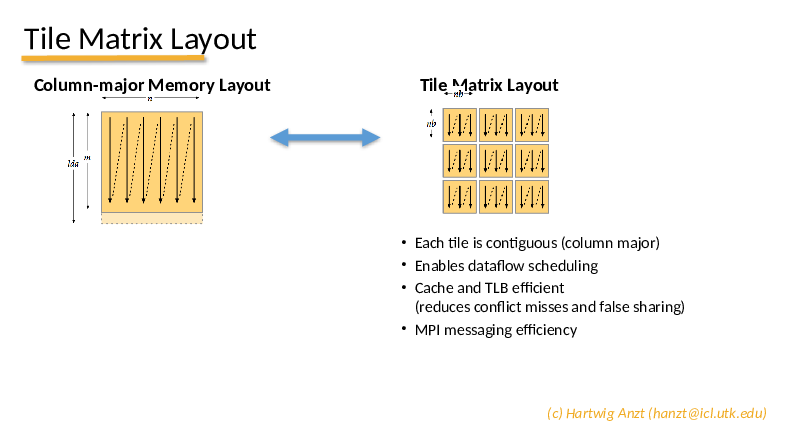

# Lab 1: Dense LU decomposition with OpenMP tasks

In this lab, we want to compute the LU decomposition of a dense matrix
on a shared-memory system (i.e., a multi-core CPU). You will use OpenMP
parallel loops and tasks to parallelize this important numerical algorithm.

In the given code template, most OpenMP statements need to be inserted, but a
working sequential LU decomposition is provded, as well as a framework for testing
and benchmarking the code. 

- The matrix is stored in tile-layout:

<object data="tile-layout.pdf" type="application/pdf" width="700px" height="700px">
    <embed src="tile-layout.pdf">
        
This browser does not support PDFs. Please download the PDF to view it: <a href="tile-layout.pdf">Download PDF</a>.

    </embed>
</object>
                

In the code, this is referred to as a "grid of blocks".

This [OpenMP cheatsheet](https://www.openmp.org/wp-content/uploads/OpenMP-4.0-C.pdf) may come in handy...

If at any point you get stuck or run out of time, you may look for inspiration
in the PDF file and/or in the solution/ subfolder.

## What you will practice here

- understanding block-wise algorithms for dense linear algebra
- Identifying data dependencies
- Task-based programming using OpenMP

## Setup on DelftBlue

- load the Intel compilers and libraries using
  ``module load 2022r2 intel/oneapi-all``
- type 'make' to compile the code
- type ``sbatch run-task_lu.slurm`` to submit a job, the result will be written to ``slurm-<jobid>.out``

## Your tasks

1. Look through the program code ``task_lu.cpp`` to understand its structure.
   In particular, go through the block-wise LU decomposition algorithm in ``factorize_loop_parallelized``
   and understand how it uses the three building blocks ``diag_fact``, ``row_update``, ``col_update`` and ``trail_update``
   to implement the algorithm.
2. Following the comments in ``factorize_loop_parallelized``, insert OpenMP pragma's to achieve shared-memory parallelization.
   Set the macro ``BENCH_FACTORIZE`` to 1 to benchmark the parallel code.
3. Now insert OpenMP task pragma's in ``factorize_task_parallelized`` to expose the parallelism available in the algorithm to the
   OpenMP runtime. Be careful to specify all dependencies to avoid so-called race conditions!
   To benchmark this version, set ``BENCH_FACTORIZE`` to 2 before compiling and running the code

